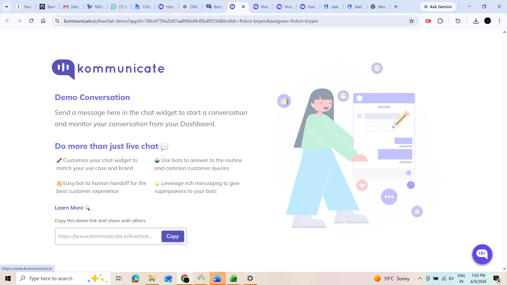
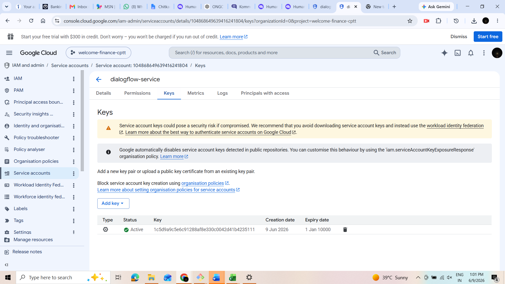
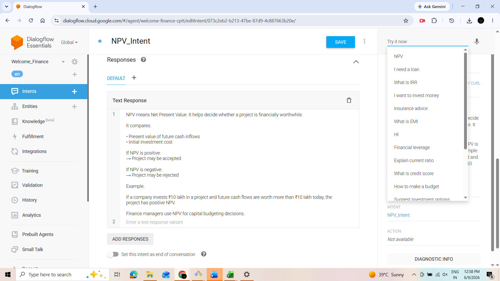

# 💰 FinBot – AI-Powered Finance Chatbot

An intelligent finance chatbot built using **Google Dialogflow** and deployed through **Kommunicate** to provide instant responses to finance-related queries. The chatbot helps users understand financial concepts, perform investment analysis, calculate financial metrics, and receive personalized financial guidance through a conversational interface.

---

## 📌 Project Overview

FinBot is a conversational AI solution designed to assist users with various financial topics. Using Natural Language Processing (NLP), the chatbot understands user queries and provides relevant financial information in real time.

The chatbot covers multiple areas of finance including investments, loans, taxation, financial ratios, profitability analysis, insurance, and personal budgeting.

---

## 🚀 Features

* AI-powered financial assistance
* Budgeting advice
* Credit score guidance
* Loan advisory support
* Insurance recommendations
* Tax-saving suggestions
* Investment analysis
* ROI calculation guidance
* IRR explanation
* NPV analysis
* Break-even analysis
* EMI calculation support
* Financial ratio interpretation
* Instant chatbot responses

---

## 🛠️ Tech Stack

| Technology            | Purpose                     |
| --------------------- | --------------------------- |
| Google Dialogflow     | Natural Language Processing |
| Kommunicate           | Chatbot Deployment          |
| Google Cloud Platform | Dialogflow Backend          |
| NLP                   | Intent Recognition          |
| Conversational AI     | User Interaction            |

---

## 📂 Project Structure

```text
FinBot/
│
├── README.md
├── Breakeven intent.png
├── Budgeting Advice.png
├── Chatbot.png
├── Credit score advisor.png
├── Current ratio.png
├── Debt equity.png
├── Default Fallback.png
├── Default welcome.png
├── EMI calculator.png
├── Insurance advisor.png
├── Integration.png
├── Investment advisor.png
├── IRR intent.png
├── NPV.png
├── ROI.png
├── Loan Advisor.png
├── Tax saving advisor.png
├── Service account.png
└── Key.png
```

---

## 🔄 Workflow Process

### Step 1: Create Dialogflow Agent

A finance chatbot agent is created in Dialogflow.

### Step 2: Create Financial Intents

Finance-related intents are designed and trained with user queries.

### Step 3: Configure Responses

Appropriate responses are added for each financial topic.

### Step 4: Integrate with Kommunicate

Dialogflow is connected with Kommunicate for deployment.

### Step 5: Deploy Chatbot

The chatbot is deployed on a web interface and tested.

---

## 📸 Project Screenshots

### Chatbot Interface



### Dialogflow Integration


### Service Account Configuration


### Kommunicate Integration Key



### Default Welcome Intent


### Default Fallback Intent


### Budgeting Advice Intent


### Credit Score Advisor


### Current Ratio Intent


### Debt Equity Ratio


### EMI Calculator


### Insurance Advisor


### Investment Advisor


### Loan Advisor


### ROI Analysis


### IRR Analysis


### NPV Analysis



### Tax Saving Advisor


### Break-even Analysis


---

## 🎯 Business Benefits

* 24/7 automated financial assistance
* Improved customer engagement
* Faster query resolution
* Reduced manual support effort
* Consistent financial guidance
* Scalable customer support solution

---

## 📈 Financial Topics Covered

* Budget Planning
* Credit Score Management
* Loan Planning
* Insurance Planning
* Tax Saving Strategies
* Investment Decisions
* ROI Analysis
* IRR Evaluation
* NPV Analysis
* Break-even Analysis
* EMI Calculations
* Financial Ratios

---

## 🎓 Learning Outcomes

Through this project, the following concepts were explored:

* Conversational AI
* Natural Language Processing
* Dialogflow Agent Development
* Intent Classification
* Chatbot Deployment
* Kommunicate Integration
* Financial Advisory Automation

---

## 🔧 Future Enhancements

* Real-Time Stock Market Data
* Mutual Fund Recommendations
* Tax Calculator Integration
* Voice-Based Financial Assistant
* Multi-Language Support
* WhatsApp Integration
* Personalized Financial Planning

---

## 👨‍💻 Author

**Divyani Kaushal**

MBA Applied Finance Student

Developed as a conversational AI project demonstrating the application of chatbot technology in financial services.

---

## 📄 License

This project is available for educational, academic, and demonstration purposes.
